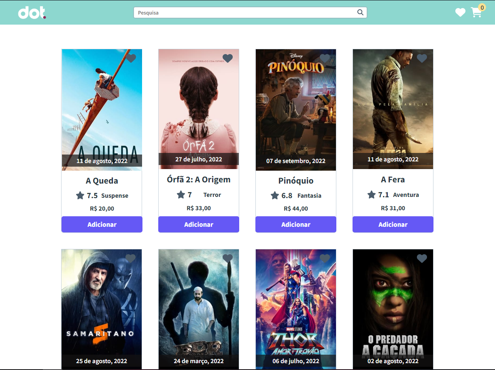

<h1 align="center">
    
</h1>

# Loja de filmes

O objetivo da aplicação é simular uma lojinha de filmes, onde o usuário pode visualizar diversos filmes populares através de scroll infinito ou pesquisar de acordo com o nome do filme desejado. O projeto também conta com funções de adicionar filmes aos favoritos e ao carrinho, ao finalizar a compra o usuário recebe um modal de aprovação de compra e é redirecionado para a home.

<h1 align="center">
    
</h1>

# O que foi utilizado:

<ul>
<li>React</li>
<li>React Router Dom</li>
<li>React Hooks</li>
<li>Styled Components</li>
<li>Context</li>
<li>Axios</li>
</ul>


# Demo 📸

<div align="center" >
  
</div>

# Pré-requisitos

Tenha instalado em sua máquina as seguintes ferramentas: Git, Node.js e Yarn ou Npm.

# Rodando a aplicação

1.Clone o projeto

```bash
# Execute o comando através do git bash na pasta desejada
$ git clone https://github.com/Thialves02/loja-filmes-DOT.git
```

2.Entre dentro da pasta clonada e execute o comando abaixo

```bash
# Instalar as dependências
$ yarn install
$ npm install
```

3.Rode a aplicação
```bash
#Abrir aplicação no navegador
$ yarn start
$ npm start
```
